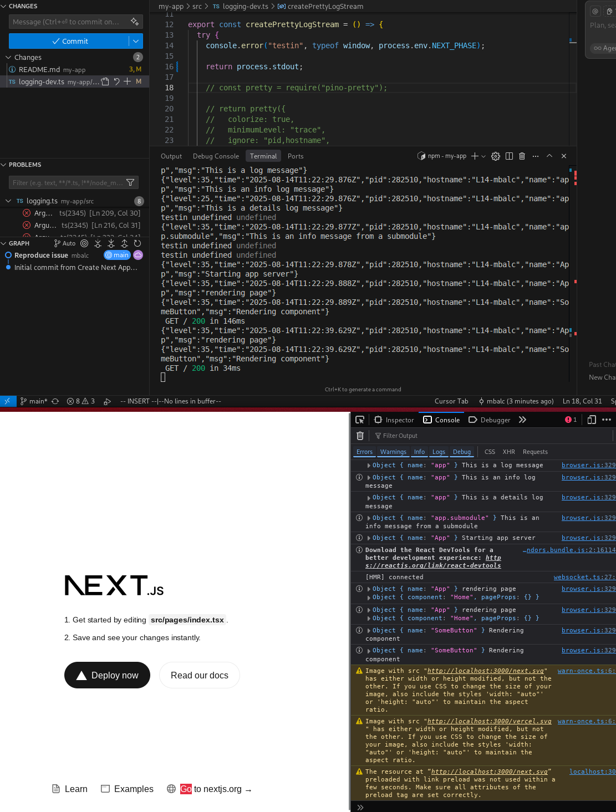
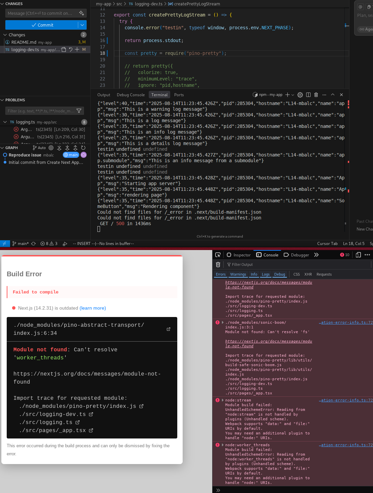

reproduce issue [pino/pino-pretty#1794](https://github.com/pinojs/pino/issues/1794)

to reproduce:
1. Run `npm run dev`
2. Logs will now work
3. Uncomment line 18 in [`src/logging-dev.ts`](./src/logging-dev.ts)
4. The error will happen (test logs on server will keep working if you restart the server)

